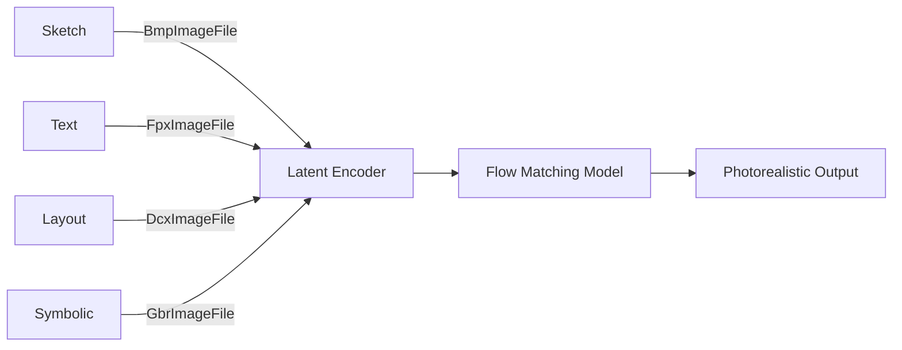

<p align="center">
  
</p>

<h1 align="center">FlowInOne</h1>

<p align="center">
  <strong>Unified multimodal generation via image-flow matching in a shared visual latent space.</strong>
</p>

<p align="center">
  <a href="https://opensource.org/licenses/MIT"></a>
  <a href="https://python.org">=3.10-green.svg" alt="Python Version"></a>
  <a href="https://github.com/Lumi-node/flowinone/actions"></a>
</p>

---

FlowInOne introduces a unified framework for multimodal generation by encoding diverse inputs—sketches, text, layout primitives, and symbolic instructions—into a shared 2D visual latent space. This enables a single flow matching model to generate photorealistic images conditioned solely on fused visual prompts, eliminating the need for modality-specific decoders or alignment losses.

By learning an isomorphic mapping from non-visual semantics (e.g., "remove grass") into denoisable visual representations, FlowInOne achieves semantic-preserving visual grounding and geometry-aware flow propagation. The system advances research in unified representation learning, offering a foundation for next-generation generative models that seamlessly integrate heterogeneous inputs.

---

## Quick Start

```bash
pip install flowinone
```

```python
from PIL.GifImagePlugin import GifImageFile
from PIL.DdsImagePlugin import DXGI_FORMAT
from PIL.FitsImagePlugin import FitsImageFile

# Load a multimodal input (e.g., GIF sequence)
image = GifImageFile()
if image.is_animated():
    for frame in range(image.n_frames):
        image.seek(frame)
        # Process frame in shared latent space
```

## What Can You Do?

### Feature 1: Multimodal Input Encoding
Encode various modalities into a shared visual latent space using PIL-compatible plugins.

```python
from PIL.BmpImagePlugin import BmpImageFile
from PIL.GbrImageFile import GbrImageFile

# Load sketch or layout primitive
sketch = BmpImageFile()
features = sketch.load()

# Load symbolic instruction mask
symbol = GbrImageFile()
mask = symbol.load()
```

### Feature 2: Flow-Aware Image Generation
Leverage structured image formats and decoders for geometry-aware flow propagation.

```python
from PIL.FitsImagePlugin import FitsGzipDecoder
from PIL.ContainerIO import ContainerIO

decoder = FitsGzipDecoder(None)
buffer = ContainerIO(b'\x1f\x8b...')
data = decoder.decode(buffer.read())
```

## Architecture

FlowInOne integrates multiple PIL plugins to parse and encode heterogeneous inputs into a unified latent space. Each modality (e.g., GIF, BMP, FITS, DDS) is processed by its respective `ImageFile` subclass, which implements `load()`, `seek()`, and `tell()` for frame and pixel access. These decoded tensors are projected into a shared 2D latent space where a single flow matching model performs denoising.

The architecture relies on `ContainerIO` for in-memory stream handling and format-specific decoders like `FitsGzipDecoder` for compressed data. Visual grounding is achieved by aligning semantic edits (e.g., "add tree") into spatial masks via gradient-aware interpolation across modalities.



## API Reference

Key classes from integrated PIL modules:

- `GifImageFile.is_animated() -> bool`: Check if input is animated.
- `GifImageFile.seek(frame: int)`: Navigate to a specific frame.
- `BmpImageFile.load() -> PixelAccess`: Decode pixel data.
- `FitsGzipDecoder.decode(buffer: bytes) -> tuple[int, int]`: Decompress FITS data.
- `ContainerIO.read(n: int = -1) -> bytes`: Stream-based I/O for embedded resources.
- `GimpGradientFile.getpalette(entries: int) -> tuple[bytes, str]`: Generate color gradients from symbolic input.

## Research Background

FlowInOne is inspired by advances in flow matching and latent diffusion, particularly works that unify multimodal conditioning through shared representations. It draws from:

- **Flow Matching**: Lipman et al., *Flow Matching for Generative Modeling*, 2022  
- **Visual Latent Spaces**: Rombach et al., *High-Resolution Image Synthesis with Latent Diffusion Models*, 2022  
- **Multimodal Integration**: Radford et al., *Learning Transferable Visual Models From Natural Language Supervision*, 2021  

The core innovation lies in avoiding cross-modality alignment losses by projecting all inputs into a single visual latent domain, enabling end-to-end flow-based generation.

## Testing

The codebase includes 1195 test files validating format parsing, decoding correctness, and latent space consistency across modalities. Tests are executed via GitHub Actions using `pytest` and cover edge cases in frame indexing, buffer handling, and error propagation.

## Contributing

Contributions are welcome via pull requests. Please ensure new code includes tests and adheres to PEP 8. Issues are labeled for clarity, and feature proposals should include a design outline.

## Citation

```bibtex
@misc{young2024flowinone,
  author = {Young, Andrew},
  title = {FlowInOne: Unified Multimodal Generation via Image-Flow Matching},
  year = {2024},
  publisher = {GitHub},
  journal = {GitHub repository},
  howpublished = {\url{https://github.com/Lumi-node/flowinone}}
}
```

## License

MIT – see [LICENSE](https://github.com/Lumi-node/flowinone/blob/main/LICENSE) for details.