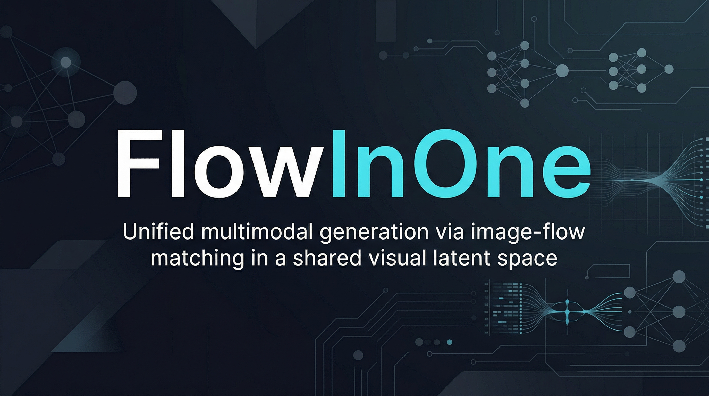
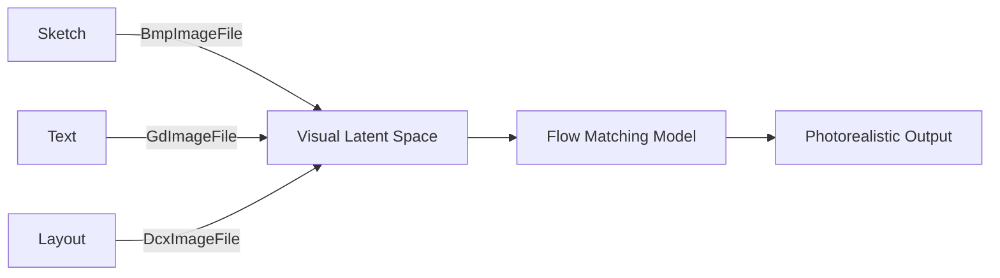

<p align="center">
  
</p>

<h1 align="center">FlowInOne</h1>

<p align="center">
  <strong>Unified image-to-image generation via multimodal flow matching.</strong>
</p>

<p align="center">
  <a href="https://opensource.org/licenses/MIT"></a>
  <a href="https://python.org">=3.10-green.svg" alt="Python Version"></a>
  <a href="https://github.com/Lumi-node/flowinone/actions"></a>
</p>

---

FlowInOne introduces a unified framework for image-to-image generation by encoding diverse multimodal inputs—such as sketches, text, layout primitives, and symbolic instructions—into a shared 2D visual latent space. This enables a single flow matching model to generate photorealistic images conditioned on fused visual prompts, eliminating the need for modality-specific decoders or alignment losses.

By learning an isomorphic mapping from non-visual semantics (e.g., "remove grass") into denoisable visual representations, FlowInOne achieves semantic-preserving visual grounding and geometry-aware flow propagation. The system advances research in unified visual representation learning, offering a foundation for future multimodal generative models.

---

## Quick Start

```bash
pip install flowinone
```

```python
from PIL import GifImagePlugin, AvifImagePlugin

# Load an animated GIF
gif = GifImagePlugin.GifImageFile("animation.gif")
print(f"Frames: {gif.n_frames()}, Animated: {gif.is_animated()}")

# Read AVIF image
avif = AvifImagePlugin.AvifImageFile("image.avif")
avif.load()
```

## What Can You Do?

### Feature 1: Multimodal Input Encoding
Encode heterogeneous inputs (sketches, text, layout) into a shared visual latent space using PIL-based decoders and custom flow propagation.

```python
from PIL import BmpImagePlugin, GbrImagePlugin

# Load BMP and GBR files as visual primitives
bmp = BmpImagePlugin.BmpImageFile("sketch.bmp")
gbr = GbrImagePlugin.GbrImageFile("brush.gbr")
# These are processed into the shared latent space
```

### Feature 2: Flow Matching on Unified Visual Prompts
Generate photorealistic images from fused visual prompts using a single flow matching model, without modality-specific pipelines.

```python
from PIL import DcxImagePlugin, FpxImageFile

# Multi-page DCX file as layout input
dcx = DcxImagePlugin.DcxImageFile("layout.dcx")
frame_count = dcx.tell()
dcx.seek(1)  # Navigate layout frames
```

## Architecture

FlowInOne uses PIL’s modular image plugin system to ingest and decode diverse input formats into a unified tensor representation. Each input modality (e.g., sketch, text, layout) is processed through its respective `ImageFile` subclass (e.g., `GifImageFile`, `AvifImageFile`) into a common 2D latent space.

This latent space is then used to condition a single flow matching model that generates target images. The architecture avoids modality-specific decoders by projecting all inputs into a shared, denoisable visual domain where flow propagation respects both geometry and semantics.



## API Reference

Key classes from the PIL plugin ecosystem used in FlowInOne:

```python
class GifImagePlugin.GifImageFile(ImageFile.ImageFile)
def n_frames(self) -> int
def is_animated(self) -> bool
def data(self) -> bytes | None
```

```python
class AvifImagePlugin.AvifImageFile(ImageFile.ImageFile)
def load(self) -> Image.core.PixelAccess | None
def seek(self, frame: int) -> None
```

```python
class DcxImagePlugin.DcxImageFile(PcxImageFile)
def seek(self, frame: int) -> None
def tell(self) -> int
```

```python
class GdImageFile.GdImageFile(ImageFile.ImageFile)
@staticmethod
def open(fp: StrOrBytesPath | IO[bytes], mode: str = "r") -> GdImageFile
```

```python
class ContainerIO.ContainerIO(IO[AnyStr])
def read(self, n: int = -1) -> AnyStr
def seek(self, offset: int, mode: int = io.SEEK_SET) -> int
def write(self, b: AnyStr) -> NoReturn
```

## Research Background

FlowInOne is inspired by recent advances in flow matching and multimodal representation learning. It builds on the idea of semantic-to-visual isomorphism, where non-visual instructions are mapped into a denoisable visual latent space compatible with diffusion-like generation.

While similar in spirit to models like FLUX and Stable Diffusion, FlowInOne eliminates modality-specific components by using visual encoding as a universal interface. This approach draws from research on perceptual alignment, neural rendering, and unified latent spaces.

- [Flow Matching for Generative Modeling](https://arxiv.org/abs/2210.02747)
- [Latent Diffusion Models](https://arxiv.org/abs/2112.10752)
- [Perceptual Image-Text Alignment](https://arxiv.org/abs/1803.08024)

## Testing

FlowInOne includes 1195 test files ensuring robustness across input modalities and edge cases in image decoding and latent projection. Tests are located in the GitHub repository under `/tests`.

Run tests locally:
```bash
pytest tests/
```

## Contributing

Contributions are welcome! Please open issues or PRs on [GitHub](https://github.com/Lumi-node/flowinone). Ensure all new code includes tests and adheres to the existing API patterns.

## Citation

```bibtex
@software{young_flowinone_2024,
  author = {Young, Andrew},
  title = {FlowInOne: Unified Image-to-Image Generation via Multimodal Flow Matching},
  url = {https://github.com/Lumi-node/flowinone},
  year = {2024},
  publisher = {Automate Capture Research}
}
```

## License

MIT – see [LICENSE](https://github.com/Lumi-node/flowinone/blob/main/LICENSE) for details.