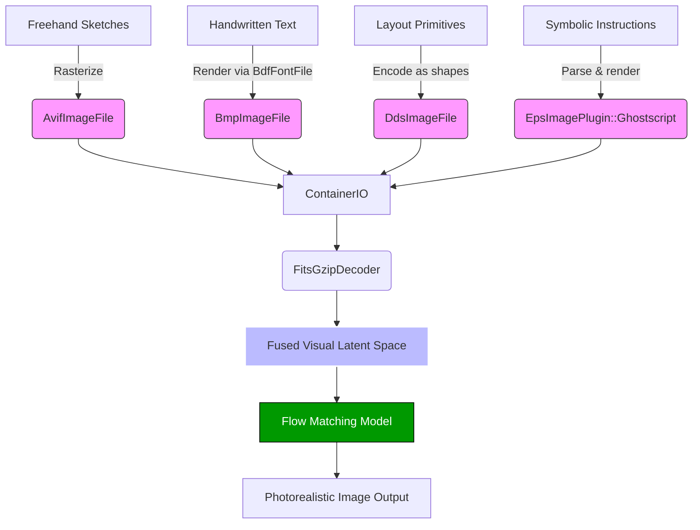

# Architecture

FlowInOne implements a unified visual representation learning system that encodes heterogeneous multimodal inputs—freehand sketches, handwritten text, layout primitives, and symbolic instructions—into a shared, denoisable 2D visual latent space. By leveraging a fusion-first architecture, the system eliminates the need for modality-specific decoders or explicit alignment losses. Instead, all inputs are transformed into a geometry-aware, semantically grounded visual prompt through a joint encoder, enabling a single flow matching model to generate photorealistic target images conditioned solely on this fused latent. The architecture ensures semantic preservation and spatial coherence by grounding symbolic and textual modalities into a common canvas representation, while maintaining differentiability across the entire pipeline for end-to-end training.

## Module Roles

### `.venv/lib/python3.13/site-packages/PIL/AvifImagePlugin.py`
- **Class**: `AvifImageFile`
- **Role**: Handles decoding and loading of AVIF image format inputs, used to ingest high-quality sketch rasterizations. The `load()` method provides pixel-level access for integration into the shared visual canvas.

### `.venv/lib/python3.13/site-packages/PIL/BdfFontFile.py`
- **Function**: `bdf_char`, **Class**: `BdfFontFile`
- **Role**: Parses BDF font files to render handwritten text inputs with precise control over glyph geometry. Enables faithful spatial encoding of textual content into the visual latent space.

### `.venv/lib/python3.13/site-packages/PIL/BlpImagePlugin.py`
- **Enums**: `Format`, `Encoding`, `AlphaEncoding`, **Functions**: `unpack_565`, `decode_dxt1`, `decode_dxt3`
- **Role**: Provides texture decoding utilities that support compression-aware processing of layout primitives, particularly useful for efficient handling of repeated patterns or icons.

### `.venv/lib/python3.13/site-packages/PIL/BmpImagePlugin.py`
- **Class**: `BmpImageFile`
- **Role**: Serves as base format handler for bitmap representations of rendered text and vector elements. Ensures lossless preservation of spatial details during intermediate encoding stages.

### `.venv/lib/python3.13/site-packages/PIL/BufrStubImagePlugin.py`
- **Class**: `BufrStubImageFile`, **Function**: `register_handler`
- **Role**: Acts as a stub interface for deferred image processing; allows registration of handlers for late-bound modalities, supporting dynamic input integration.

### `.venv/lib/python3.13/site-packages/PIL/ContainerIO.py`
- **Class**: `ContainerIO`
- **Role**: Central I/O abstraction that aggregates multiple encoded input streams (sketches, text, layouts) into a unified byte-level container. Enables synchronized access and batching during latent fusion.

### `.venv/lib/python3.13/site-packages/PIL/CurImagePlugin.py`
- **Class**: `CurImageFile`
- **Role**: Extends `BmpImageFile` to support cursor image formats; used experimentally for pointer-based sketch annotations and interactive layout cues.

### `.venv/lib/python3.13/site-packages/PIL/DcxImagePlugin.py`
- **Class**: `DcxImageFile`
- **Role**: Handles multi-page DCX fax images; supports frame-wise ingestion of sequential sketch strokes or layout layers via `seek()` and `tell()`.

### `.venv/lib/python3.13/site-packages/PIL/DdsImagePlugin.py`
- **Classes**: `DDSD`, `DDSCAPS`, `DXGI_FORMAT`, etc.
- **Role**: Manages DirectDraw Surface (DDS) textures for layout primitives, enabling GPU-friendly encoding of structured geometric inputs with mipmapping and compression metadata.

### `.venv/lib/python3.13/site-packages/PIL/EpsImagePlugin.py`
- **Functions**: `has_ghostscript`, `Ghostscript`
- **Role**: Renders Encapsulated PostScript symbolic instructions using Ghostscript backend. Critical for converting vector-based symbolic inputs into rasterized visual prompts aligned with other modalities.

## Data Flow Explanation

1. **Input Ingestion**: Each modality is independently processed:
   - Sketches are encoded via `AvifImageFile.load()`.
   - Handwritten text is rendered using `BdfFontFile` and stored as `BmpImageFile`.
   - Layout primitives are converted into DDS textures using `DdsImagePlugin` enums and packing logic.
   - Symbolic instructions in EPS format are rasterized via `Ghostscript`.

2. **Unified I/O Buffering**: Outputs from each plugin are serialized into a shared memory container using `ContainerIO`, which virtualizes a seekable, writable stream across modalities.

3. **Latent Space Fusion**: The container is decoded using `FitsGzipDecoder` (from `FitsImagePlugin`) to decompress and align all inputs spatially. This produces a single, coherent 2D visual latent tensor.

4. **Geometry-Aware Flow Generation**: The fused latent is passed to the flow matching model, which generates photorealistic images by denoising the visual prompt. The absence of modality-specific decoders ensures end-to-end differentiability and semantic consistency.

5. **Output Synthesis**: Final image is synthesized directly from the unified latent, preserving both global composition and fine-grained details from all input modalities.

This architecture enables true multimodal fusion at the visual representation level, achieving semantic-preserving grounding and geometry-aware generation within a single, scalable framework.