# Architecture

FlowInOne is a unified visual representation learning system designed to encode heterogeneous multimodal inputs—such as freehand sketches, handwritten text, layout primitives, and symbolic instructions—into a shared, denoisable 2D visual latent space. By leveraging a consolidated visual prompt, the system enables a single flow matching model to generate photorealistic target images without requiring modality-specific decoders or explicit alignment losses. Central to this architecture is semantic-preserving visual grounding and geometry-aware flow propagation, ensuring that structural and symbolic semantics are faithfully preserved throughout the generation process. The system integrates low-level image parsing and decoding capabilities through the Python Imaging Library (PIL) plugins to support diverse input formats, enabling robust preprocessing and unified encoding into the latent space.

```mermaid
graph TD
    A[Freehand Sketches] --> G[Visual Encoder]
    B[Handwritten Text] --> G
    C[Layout Primitives] --> G
    D[Symbolic Instructions] --> G
    E[PIL Image Plugins] --> G
    F[ContainerIO / Stream Handlers] --> E

    subgraph "PIL Plugin Modules"
        E1[AvifImagePlugin::AvifImageFile] -->|decode| E
        E2[BmpImagePlugin::BmpImageFile] -->|decode| E
        E3[BlpImagePlugin] -->|decode DXT/565| E
        E4[DcxImagePlugin::DcxImageFile] -->|multi-frame PCX| E
        E5[DdsImagePlugin] -->|DDS texture decoding| E
        E6[EpsImagePlugin] -->|Ghostscript-based PS| E
        E7[FitsImagePlugin::FitsImageFile] -->|scientific imaging| E
        E8[GifImagePlugin::GifImageFile] -->|animated GIF support| E
        E9[GdImageFile] -->|GD library format| E
        E10[GbrImageFile] -->|GIMP brush format| E
        E11[FpxImagePlugin::FpxImageFile] -->|FlashPix decoding| E
        E12[FtexImagePlugin::FtexImageFile] -->|texture format| E
    end

    subgraph "Core Utilities"
        F1[ContainerIO::ContainerIO] -->|stream abstraction| E
        F2[BdfFontFile::BdfFontFile] -->|font rasterization| B
        F3[GimpGradientFile] -->|interpolation curves| G
        F4[GimpPaletteFile] -->|color palette parsing| E
    end

    G --> H[Shared 2D Visual Latent Space]
    H --> I[Flow Matching Model]
    I --> J[Photorealistic Output Image]

    style G fill:#4c78a8,stroke:#333
    style H fill:#54a24b,stroke:#333
    style I fill:#e45756,stroke:#333
    style J fill:#72b7b2,stroke:#333
```

## Module Roles

- **`AvifImagePlugin::AvifImageFile`**: Handles decoding of AVIF (AV1 Image File Format) images using hardware or software codecs. Provides frame seeking and pixel loading via `load()` and `seek()`, enabling integration of modern compressed image inputs into the visual pipeline.

- **`BdfFontFile::BdfFontFile`**: Parses BDF (Bitmap Distribution Format) font files, enabling rendering of symbolic text inputs. Used to convert handwritten or symbolic instructions into rasterized glyphs for visual encoding.

- **`BlpImagePlugin`**: Decodes Blizzard’s BLP texture format, including DXT1/DXT3 compression and 565 RGB unpacking. Supports game asset ingestion through efficient texture decompression.

- **`BmpImagePlugin::BmpImageFile`**: Native decoder for BMP image files. Serves as a base class for other formats like `.cur` and ensures lossless parsing of uncompressed raster data.

- **`BufrStubImagePlugin::BufrStubImageFile`**: Placeholder handler for BUFR meteorological data files. Registers stubs for deferred or external decoding, allowing extensibility for scientific data modalities.

- **`ContainerIO::ContainerIO`**: Provides a file-like interface for in-memory byte streams. Enables uniform handling of embedded or virtual image data across plugins, critical for processing symbolic or generated inputs.

- **`CurImagePlugin::CurImageFile`**: Extends `BmpImageFile` to support Windows `.cur` cursor files with hotspot metadata. Facilitates layout-aware visual primitives with positional anchors.

- **`DcxImagePlugin::DcxImageFile`**: Manages DCX (multi-page PCX) container images. Allows frame-by-frame access via `seek()` and `tell()`, supporting animated or layered sketch inputs.

- **`DdsImagePlugin`**: Parses DirectDraw Surface (DDS) files with support for compressed textures (DXTn) via flags like `DDSD`, `DDSCAPS`, and `DXGI_FORMAT`. Enables high-performance texture decoding for 3D-aware layouts.

- **`EpsImagePlugin`**: Renders EPS (Encapsulated PostScript) files using Ghostscript. Converts vector-based symbolic instructions into raster images for visual grounding.

- **`FitsImagePlugin::FitsImageFile`**: Reads FITS (Flexible Image Transport System) files used in astronomy. Integrates scientific imaging data via `PyDecoder` pipeline, supporting metadata-rich inputs.

- **`FliImagePlugin::FliImageFile`**: Decodes FLI/FLC animations. Supports temporal sequences of layout primitives through frame navigation.

- **`FontFile`**: Base utilities for font compilation and storage. Used by `BdfFontFile` to generate `ImageFont` instances for text rendering.

- **`FpxImagePlugin::FpxImageFile`**: Parses Kodak FlashPix images, enabling multi-resolution input handling. Supports `load()` and `close()` for resource management.

- **`FtexImagePlugin::FtexImageFile`**: Handles FTEX texture format with custom `load_seek()` for offset-based decoding. Useful for embedded GPU textures in symbolic layouts.

- **`GbrImagePlugin::GbrImageFile`**: Loads GIMP brush files (.gbr), preserving opacity and mask channels. Enables stylized stroke representation in sketch encoding.

- **`GdImageFile`**: Reads GD library native image format. Offers direct `open()` method for legacy web graphics integration.

- **`GifImagePlugin::GifImageFile`**: Supports animated GIFs with `n_frames()`, `is_animated()`, and frame data access. Allows temporal sketch or instruction sequences.

- **`GimpGradientFile`**: Parses `.ggr` gradient files and provides interpolation functions (`linear`, `sine`, `sphere_decreasing`, etc.). Used to model smooth transitions in layout design.

- **`GimpPaletteFile`**: Loads `.gpl` palette files into usable color maps. Ensures consistent color semantics across symbolic and layout inputs.

- **`GribStubImagePlugin`**: Stub handler for GRIB (GRIdded Binary) weather data. Enables future integration of geospatial modalities.

## Data Flow Explanation

The FlowInOne system begins by ingesting multimodal inputs: sketches, text, layout elements, and symbolic instructions. Each modality is processed through appropriate PIL plugins:

- Raster images (AVIF, BMP, DDS, etc.) are decoded using their respective `ImageFile` subclasses (`AvifImageFile`, `BmpImageFile`, `DdsImageFile`, etc.), which standardize pixel access via `load()` and support frame navigation via `seek()` where applicable.
- Handwritten text and symbolic glyphs are rasterized using `BdfFontFile` and `FontFile`, producing consistent visual tokens.
- Layout primitives (e.g., gradients, palettes, brushes) are parsed via `GimpGradientFile`, `GimpPaletteFile`, and `GbrImageFile`, ensuring stylistic and geometric fidelity.
- Containerized or multi-frame data (GIF, DCX, FLI) are handled using `ContainerIO` and frame-aware plugins, enabling temporal or layered processing.
- Vector or script-based inputs (EPS) are rendered via external tools like Ghostscript, producing rasterized visual prompts.

All decoded and rendered outputs are unified into a shared 2D visual latent space through a visual encoder that preserves semantic and geometric structure. This fused representation is then processed by a single flow matching model, which denoises and generates a high-fidelity photorealistic image. The use of standardized PIL interfaces ensures that diverse input modalities are grounded in a common visual syntax, eliminating the need for modality-specific decoders or alignment losses.